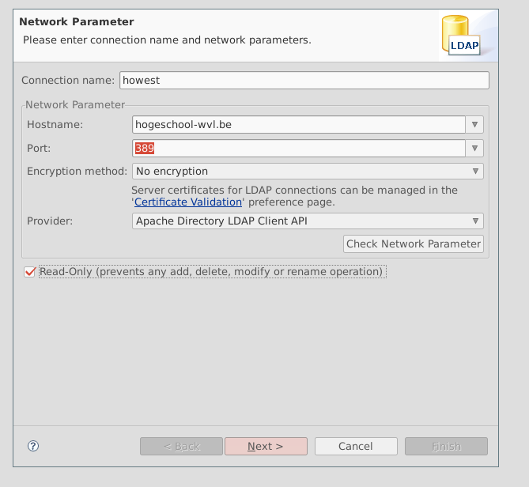
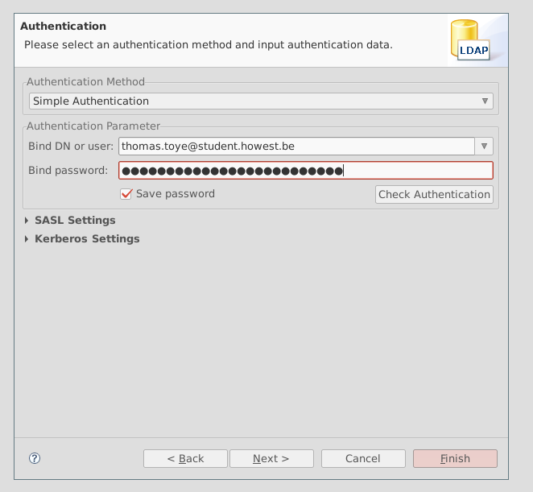
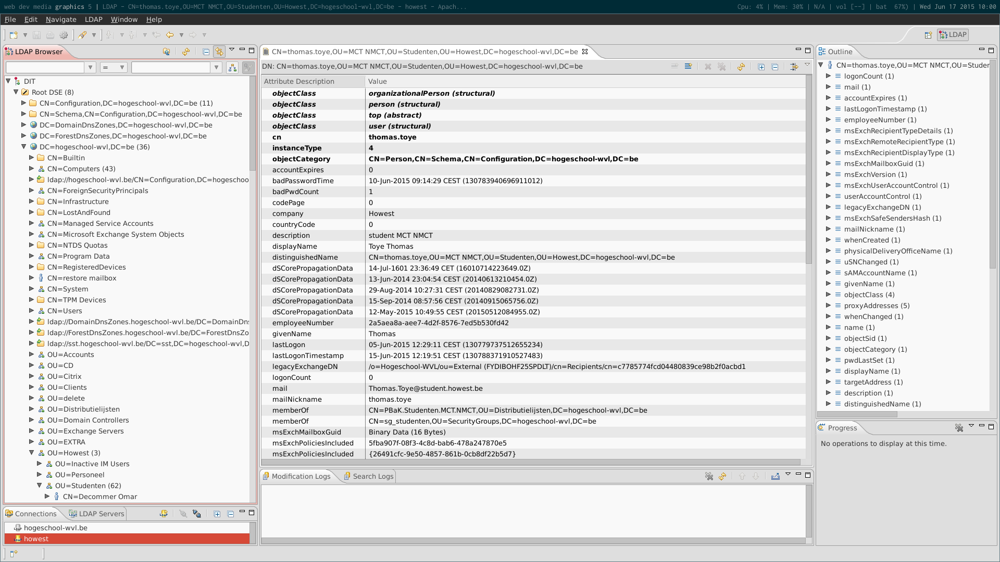

# howestX documentation

## Preface

This is the documentation for howestX. howestX is a pilot project for Howest (Howest University College West Flanders). The goal of this project was to evaluate the feasibility of adapting a MOOC platform. Three groups each evaluated a MOOC platform of their choice, howestX evaluated the edX Open Platform. In this document you will find all of our documentation, findings, technical solutions and technical recipes.

## Technical documentation

### Pre-requisite knowledge

This section lists pre-requisite knowledge, tools and technologies that the implementors should be familiar with before reading on. This section will briefly introduce these technologies in an edX context, and include links to online documentation to read up on the subjects presented.

#### Python

Python is a dynamic, high-level programming language with a focus on readability. Most of the edX platform is written in Python.

##### Virtual environments

Python uses packages to manage dependencies. This can introduce problems when you run multiple Python applications on a single machine. When upgrading a packages for one application, the second application may break if depends on a different version than the new dependencies.

For this, the Python community has introduced *virtual environments*. These provide isolated packages in seperate environments. Usually, there will be one environment per application.

Virtual environments (or *venvs* for short) need to be *activated* before you can do work in them. There will be a `bin/` folder in a virtual environment, containing multiple scripts. You can *source* the `activate` script to enable the virtual environment. This is done like this

    $ . ./venv/bin/activate

Notice the dot. This means the argument will be a script to source.

After sourcing, you will notice that your shell `$PATH` has changed. The `python`, `pip` and other executables will be those from inside the virtual environment. When you install a package with `pip`, it will be installed in the virtual environment.

##### pip

*pip* is the most popular package manager for Python. Packages can be installed using `pip install packagename`.

##### Django

Django is the most popular Python web framework.

#### Less and Sass

Less and Sass are CSS pre-processors. They extend CSS with variables and functions, leading to a more maintainable frontend codebase. Less and Sass files are compiled down to CSS files so a browser can read them.

Less and Sass serve the same purpose, and have similar features, but are not compatible. Sass is mostly used in the Ruby world, Less is mostly used in the node.js world.

#### SSH

Secure Shell, or SSH, is a protocol for connecting to remote computers. It's also commonly used for connecting to remote git repositories. SSH is an encrypting protocol that can make use of both cryptographic keys and passwords.

#### Vagrant

The goal of Vagrant in the edX project is to give all developers the same development environment. It does this through the use of virtual machines. Vagrant is  a wrapper around a VM provider backend. For the edX platform, the VirtualBox backend is used.

In edX, Vagrant is used to run the development stack. This makes sure all developers are working with the same software, and the same versions. This makes it easier to reproduce problems and bugs.

Vagrant machines are specified using a `Vagrantfile`, a file that specifies the virtual machine's properties: RAM, vCPUs, what ports that should be forwarded from the host and, most important of all, the base image.

Base images, also known as base boxes, are virtual machines on which projects can base themselves. For example there is an Ubuntu 12.04 base, a FreeBSD base, ...

The first time a box is started, it will be *provisioned*. The base image will be started, and on it, the provision scripts will run. This only has to happen once, but you can force reprovisioning if something is wrong.

#### Ansible

Ansible is a way to automate provisioning of (virtual) machines. It's used extensively in the edX project due to the complexity of edX deployments. With Ansible, task are neatly split up (there are roles to set up repositories, roles to set up ElasticSearch, roles to install Python packages, ...).

#### LDAP

LDAP (*Lightweight Directory Access Protocol*) is a protocol that allows clients to search, modify and connect to internet directories. We will use it here in an authentication contexts: we will make clients authenticate to an LDAP server.

LDAP uses port 389 (not to be confused with RDP, which uses port 3389). LDAPS, LDAP over SSL, uses port 636. LDAP uses both TCP and UDP.

#### Central Authentication Service (CAS)

A CAS server provides Single Sign-On for an organisation. This means that users sign in once, and are then signed in automatically across other applications. This is not the case with LDAP. Using LDAP, users have to sign in into every application and authentication happens on the LDAP server.

A CAS server provides multiple pluggable backends. You can plug in a SQL database, an LDAP server...

Using a CAS server is comparable to OAuth. When users click *Log in*, they are taken to the CAS server's login page. After authenticating with the CAS server, they are taken back the application.

### edX architecture

The architecture of edX is very complex. To give you a rough idea, in the codebase you can find Python, Ruby, node.js and Java sources. Here, we will take a quick look at the edX Platform architecture, and take a quick look at how edX is expected to be used.

#### Named releases
Because the edX platform evolves at a rapid pace, "named releases" have been created. These are LTS-versions, comparable to how Ubuntu works. Upgrade paths will be made available between two named releases. It made sense to start working on the latest named release, since it's stable with a lot of support available. And it improves the maintainabiliy (since we'll no longer have to upgrade every day).

The first named release was `Aspen`. The current one is `Birch`. It was released quite recently, on februari 24 2015. The next one will be `Cypress`.

An example of an upgrade from `Aspen` to `Birch`

    ./migrate.sh -c devstack

A single line of code, running a script that automates everything. We're very pleased with this, and it strengthens our trust in edX as a platform.

##### Developing on a named release

Development on a named release is easy, simply set an environment variable before you start the vagrant machine

    export OPENEDX_RELEASE="named-release/birch"
    vagrant up
    
Attention! You must execute this BEFORE you start the machine for the first time, otherwise you'll have to destroy and try again. All the steps are

    curl -L https://raw.githubusercontent.com/edx/configuration/master/vagrant/release/devstack/Vagrantfile > Vagrantfile
    vagrant plugin install vagrant-vbguest
    export OPENEDX_RELEASE="named-release/birch"
    vagrant up

#### Differences between edX distributions

edX has different distributions (often called *stacks*), each with a different purpose.

##### Devstack

The *devstack* is intended for local development. Its lifecycle is managed through Vagrant. To create a devstack virtual machine, you download a `Vagrantfile` from edX, and run `vagrant up`. This will download a VirtualBox base image and provision the machine.

Development on the devstack is easy, because Vagrant exposes a few folders (`edx-platform`, `themes` `ora` and `cs_comments_service`) as NFS mounts, allowing you to edit file on the host computer. This means that you don't have to edit files on the guest.

##### Fullstack

The *fullstack* is a distribution that runs edX in production mode, with all services on one machine. This is not recommended for production deployments. This distribution is ideal for staging and evaluating.

##### Production stack

The *production stack* is what is recommended for production. The production stack is hard to deploy, since it's very complex, but an Amazon Web Services template is provided. It contains multiple machines, databases and load balancers.

#### Persistence

These are the main database systems in use for edX:

* MySQL, a popular relational database
* MongoDB, a popular JSON-based NoSQL database

Some online resources may say that Sqlite is used in the devstack, but this is no longer the case. Devstack provisions a MySQL database.

##### Usage of MySQL

MySQL is used to keep user data (login data, user progress, ...).

##### Usage of MongoDB

MongoDB is used to store courses (the courses you design in edX Studio). Historically, this information was stored in XML files. MongoDB was a better fit than a relational database to store this data in.

#### Authentication

Authentication is handled through standard Django. The Django framework provides a flexible way to handle authentication. It's possible to define multiple *authentication backends*, the framework will try each of them in succession until either one successfully authenticates the user, or none are left. User details, such as login name, email address, and for the standard backend, a password, are saved in a relational database.

##### CAS

LDAP isn't a great match for edX. It requires the installation of extra packages, requires modifications to the edX platform, and feels clunky.

edX actually has a built-in solution for central authentication: it provides support for a Central Authentication Service server. Enabling a CAS server is a matter of enabling a few simple configuration entries.

However, this is not ideal if you want to allow users to register themselves. You can't easily use the existig capabilities of edX/Django, you would have to write a registration handler and authentication backend for CAS, seperate from your edX codebase.

Thus, CAS is not a good match if you want hybrid authentication (authentication through LDAP, but also allowing registering and logging in directly through edX).

##### Default users

There are a number of default user accounts accounts available:

* `staff@example.com`, password: `edx`, staff account that can create courses
* `verified@xeample.com`, password: `edx`, student account for testing verified courses
* `audit@example.com`, password: `edx`, student account for testing course auditing (meaning: following the course without paying for it)
* `honor@example.com`, student account for testing honor code certificates

#### LMS and CMS

The edX platform is split in two main front-facing sites: the LMS (Learning Management System) and the CMS (Content Management System).

##### The Learning Management System

The *Learning Management System*, or LMS for short, is where students spend their time. This is the main platform, which lists courses, allows students to enroll into courses and allows students to partake in courses.

##### The Content Management System

The *Content Management System*, often called edX Studio, Studio or CMS, allows teachers to create, edit, preview and publish courses.

#### Themes

edX now has a flexible theme structure. Aside from configuring to use the new theme, the platform isn't modified in any way when creating or updating a theme.

Themes go into a `themes/` folder. The theme to use can then be specified in the configuration.

##### Existing themes

There are only a few existing themes on which we can base a custom theme.

* The built-in theme: this is the theme that is inside the edX platform core, and the default that gets loaded. This means that you have to edit the platform to update the theme, which is not something you want to do, especially since edX supports external themes.
* The Stanford theme: this is the theme that Stanford University uses. This theme is not responsive, which was a dealbreaker for us.
* IONISx theme: the theme developed by the French IONIS Education Group. This theme is based on Bootstrap, and responsive by default.

##### Choice of theme

We decided to adapt the IONISx theme to our needs. Being responsive from the start is a huge plus, and the external theming support helps provides a clean split between frontend and backend code.

##### Less in the IONISx theme

The IONISx theme used Less (not Sass, like the edX platform). The edX platform doesn't understand Less. Installing a Less pre-processor on the platform would require a whole slew of packages to be brought in and an extra build pipeline. That's not ideal.

Our solution is to check in the compiled files into source control. That's not very pretty, but it works. A `grunt` watcher watches for changes, and executes the build.

This makes it easy to release the theme: the production edX platform can just pull in the repository.

#### Certificates

Some people just want to participate in a course for personal education, but others want to participate in order to obtain proof they are qualified in certain subjects. These last people require certification in order to proof they have the necessary skills to get a certain job or be accepted in certain educational institutions.

##### Certification in edx

edX has the capability to provide a couple forms of certification, here's a list of the types of certificates you can obtain in edx.

###### Honor code certificates

These a basic certificates that say you passed a certain course, there is however no verification at all about your identity. This makes this an easy to obtain certificate, but with little real value.

###### Verified certificates

These certificates say you passed a course and verifies your identity. This happens by using pictures from your webcam and your ID. To obtain one of these certificates, a user must specify he is interested in one when he participates in a course. The user will also have to pay a fee for this certificate that can vary on a course-to-course basis.

###### XSeries certificates

XSeries certificates can be obtained when you pass for a series of courses that all fit within a certain subject. These might be useful in implementing the Howest tracks. There could be an XSeries certificate for a web developer, for example. XSeries certificates also require a fee that can vary.

##### What about archived courses?

There are no certificates available for archived courses. These courses can only be audited and some features, such as the discussion forums, may not be available.

##### Are refunds possible?

Yes, there is a period of 2 weeks from the start date of a course that someone can change their mind. He can still continue his course, but without the intention of obtaining a certificate. Of course, whether you offer refunds and for how long is a decision every organisation must make for itself.

##### What happens when someone obtains a certificate?

The certificate will be generated and sent to the user via email. In that email will be a link to a PDF-file that contains the certificate.

#### Configuration

Configuration in edX is very complex. Here are some hints on the possible files:

* `lms.env.json` and `cms.env.json` are generated by provisioning script. You can edit them to test.
* `common.py` sets all the default variables, which can be overwritten by Ansible configuration
* `server-vars.yml` (full location: `/edx/app/edx_ansible/server-vars.yml`) sets configuration that will be used to provision the machine. This will be used to populate `*.env.json`. A list of all possible option can be found [here](https://github.com/edx/configuration/blob/master/playbooks/roles/edxapp/defaults/main.yml).

Be wary that there are `.json` and `.yml` files. JSON and YAML have different syntaxes.

### edX license

For a detailed description, see the [Open edX Licensing page](https://open.edx.org/open-edx-licensing) on the Open edX website.

The gist is that `edx-platform`, `edx-configuration` and `edx-ora2` are released under the AGPL. This means that derived code must also be released under the AGPL, that you may modify the code, and that you must disclose the source code. Other source code is Apache licenced, meaning that you do not need to distribute sources.

### Development and deployment recipes

#### Vagrant recipes

##### Installing Vagrant on a Mac OS machine

Mac OS users can download Vagrant as a `.dmg` from [its website](http://www.vagrantup.com/downloads.html). Installation works as usual, but you will have to install VirtualBox seperately from [here](https://www.virtualbox.org/wiki/Downloads).

##### Installing Vagrant on a Linux machine

We suggest that Linux users **do not** install Vagrant using their package manager. The Vagrant in the Debian and Ubuntu repositories is often out of date, and this may cause strange errors when developing on the edX platform. Instead, we encourage Linux users to install Vagrant from [its website](http://www.vagrantup.com/downloads.html).

VirtualBox may be installed through the package manager, but Debian users will have to [enable non-free packages](http://serverfault.com/questions/240920/how-do-i-enable-non-free-packages-on-debian).

##### Setting up a Vagrant devstack machine

You can set up a Vagrant virtual machine for local development and testing. These instructions are for Mac and Linux systems, Windows users can use [Cygwin](https://www.cygwin.com/), but, as mentioned previously, we do not recommend this.

    $ mkdir howestx
    $ cd howestx
    $ curl -L https://raw.githubusercontent.com/edx/configuration/master/
      vagrant/release/devstack/Vagrantfile > Vagrantfile
    $ vagrant plugin install vagrant-vbguest
    $ vagrant up

This is what happens:

* Inside a new `howestx` directory, we download a `Vagrantfile`.
* We then install the `vagrant-vbguest` plugin. This only needs to happen once.
* Then we start up the virtual machine using `vagrant up`:
  - If this is the first time you set up an edX Vagrant development box, it will have to download a VirtualBox base image. This image will be roughly 3GB.
  - If this is the first time this specific virtual machine starts up, the machine be provisioned. This happens automatically. The virtual machine will download and run ansible scripts. This may take a while (15 minutes). This only happens once, unless you destroy or reprovision the virtual machine.
  - If the virtual machine already exists, it will be booted. This only takes a few minutes.

##### Accessing a running Vagrant devstack machine

You can access a running Vagrant devstack machine through SSH:

    $ vagrant ssh

##### Shutting down a running Vagrant machine

You may shut down a running Vagrant machine using `halt`:

    $ vagrant halt

It is very important to **halt all Vagrant virtual machines before shutting down the host machine**. This does not happen automatically. If you shut down the host with running Vagrant guests, corruption of the virtual machines may occur.

##### Dealing with corrupted Vagrant virtual machines

If your Vagrant guest has gotten corrupted or otherwise unworkable, you may do one of two things:

* Reprovision the virtual machine: reprovisioning the virtual machine will re-run the Ansible scripts on the existing virtual machine.
* Destroy the virtual machine: destroying the Vagrant virtual machine will remove the NFS mounts and all VirtualBox files.

Usually, destroying the virtual machine makes more sense, since you will then start from a clean slate and creating a new Vagrant virtual machine won't take much longer than reprovisioning (provided that the VirtualBox image is still cached).

You may reprovision a Vagrant virtual machine like this:

    $ vagrant provision

You may destroy a Vagrant virtual machine like this:

    $ vagrant destroy

Note that destroying a Vagrant virtual machine will not remove the `Vagrantfile`. You can immediately `vagrant up` again. Also, if you have ever brought this box up, the VirtualBox base image will be cached, and Vagrant will not have to download the base image.

###### Advanced Vagrant trouble

Occasionally, Vagrant will still have trouble (happens rarely, e.g. when the host crashes, or if you manually edit Vagrant's private files). You can then try to follow the following steps:

* Purge Vagrant from your system
* Delete `~/.vagrant.d`, if it still exists
* Delete all Vagrant VMs using the VirtualBox GUI
* Remove all Vagrant NFS exports from `/etc/exports`
* Reinstall Vagrant

#### Devstack recipes

This section assumes you have a running devstack virtual machine with Vagrant.

###### Fixing MongoDB

Occasionally, MongoDB will have problems. This will happen when it quit unexpectedly. The `mongod` service will then refuse traffic and throw errors. You can try this to fix it:

    $ su vagrant
    $ sudo rm /edx/var/mongo/mongodb/mongod.lock
    $ sudo service mongod restart

###### Accessing the MySQL server

You may access the MySQL server by using this command:

    $ mysql -u root

This will drop you in a SQL shell. The primary database edX uses is `edxapp`.

It's also possible to access the database from a GUI (for example, MySQL Workbench). Turn on the *Tunnel through SSH* option on with the IP address of the Vagrant guest, use `vagrant` as the username and `vagrant` as the password, and you're good to go.

#### Theming recipes

##### Bootstrapping a custom theme based on the IONISx theme

You can bootstrap a custom theme on devstack by following these steps:

- Install global dependencies: install [node.js](https://nodejs.org/) from its website, then install `grunt-cli` and `bower` globally (you only need to do this once on every development machine):

    $ npm install -g grunt-cli bower

- Clone the IONISx theme to a repository of your own. This will allow you to push back commits you make to this repository.
- Go into the `themes/` folder of edX on your local machine. It's mounted into the Vagrant virtual machine, so you can access it from your own computer.
- Clone the repository here. You may rename the folder. The name of the folder is your theme name, and this is very important. This is what you will have to provide to the configuration files.
- Rename the `_ionisx.scss` file located in the `static/sass/` folder to match your theme name (name of the folder). Your theme will not function if you don't do this.
- Now install the dependencies of the theme:

    $ npm install
    $ bower install

- Run `grunt`. The default mode will watch until you press `^C`. As soon as you save, Grunt will pick it up and recompile all the assets. The edX platform can't process the Less files, so it's important to compile these down to CSS.

##### Using a custom theme in devstack

To use a custom theme in the devstack, you can update `lms.env.json`. This file is located in the home directory of the `edxapp` user.

    $ vim ~/lms.env.json

Two modifications need to be made

1. In the `FEATURES` list, set `USE_CUSTOM_THEME` to `true`
1. Set the `THEME_NAME` entry to the name of your theme (for example, `howestx-theme`)

It should look like this:

    {
        ...
        "FEATURES": {
            ...,
            "USE_CUSTOM_THEME": true
        },
        ...
        "THEME_NAME": "howestx-theme",
        ...
    }

You need to run (or restart if it's already running) `paver` to see the effect in your browser:

    edxapp@~/edx-platform$ paver devstack lms

##### Editing a custom theme

##### Using a custom theme in fullstack

Edit the `/edx/app/edx_ansible/server-vars.yml` file on the fullstack server and add the following variables

    edxapp_use_custom_theme: true
    edxapp_theme_name: 'howestx-theme'
    edxapp_theme_source_repo: 'git://github.com/howestx/howestx-theme.git'
    edxapp_theme_version: 'HEAD'

Then run the update script

    $ sudo /edx/bin/update edx-platform master

You may specify another branch of the `edx-platform` by changing `master` in the update command.

#### Deployment recipes

##### Fullstack deployment

###### On an Ubuntu 12.04 machine

You can install a fullstack deployment on an Ubuntu 12.04. It's important that you do this on a "fresh" server (nothing installed yet) using the following

    $ sudo apt-get update -y
    $ sudo apt-get upgrade -y
    $ sudo reboot

After rebooting, you can install using the one-step install script

    $ wget https://raw.githubusercontent.com/edx/configuration/master/util/install/sandbox.sh -O - | bash

You can also install using  named release

    $ export OPENEDX_RELEASE=named-release/birch
    $ wget https://raw.githubusercontent.com/edx/configuration/$OPENEDX_RELEASE/util/install/vagrant.sh -O - | bash

Be aware that this does **not** work with Ubuntu 12.04.5 (the standard on Azure and DigitalOcean)! You should install the latest release using the first script.

###### Elasticsearch SSL certificate trouble

In the latest release, you may see an error with Elasticsearch's certificate

    TASK: [elasticsearch | download elasticsearch] ****************************

    failed: [localhost] => {"failed": true, "item": ""}

    msg: Failed to validate the SSL certificate for download.elasticsearch.org:443. Use validate_certs=no or make sure your managed systems have a valid CA certificate installed. Paths checked for this platform: /etc/ssl/certs, /etc/pki/ca-trust/extracted/pem, /etc/pki/tls/certs, /usr/share/ca-certificates/cacert.org, /etc/ansible

A work-around is to edit the Ansible configuration file

    $ vim /var/tmp/configuration/playbooks/roles/elasticsearch/defaults/main.yml

Change the variable `elasticsearch_url` from `https` to `http`. **Only use this as a temporary work-around for testing!** The certificate will probably be fixed in a coming release. You now need to reprovision the server

    $ cd /var/tmp/configuration/playbooks && sudo ansible-playbook -c local ./edx_sandbox.yml -i "localhost,"

###### Using an edX platform fork

You use a custom `edx-platform` for the fullstack too. Add the following to `/edx/app/edx_ansible/server-vars.yml`

    edx_platform_repo: "https://github.com/HowestX/edx-platform.git"

Obviously using your own repository. Then you need to remove the existing platform

    $ sudo rm -rf /edx/app/edxapp/edx-platform

Then reprovision the server

    $ sudo /edx/bin/update edx-platform release

`release` is a git branch. You can always specify a custom branch.

##### Production deployment

### AWS deployment

There are public AMI's available for AWS, for europe that's `ami-aa76d0dd`. It's recommended to deploy this on an t2.medium instance.

Start the server and connect to it via ssh (the user is 'ubuntu')

    chmod 400 {path-to-keypair}
    ssh -i {path-to-keypair} ubuntu@{public-ip}

Then update the codebase

    sudo /edx/bin/update configuration release
    sudo /edx/bin/update edx-platform release
    
In case you get an 'Unable to resolve host' error, add the following to `/etc/hosts`

    127.0.1.1 {whatever ip}
    
If there's an error in the 'edx-platform-release' execute the following

    cd /edx/app/edxapp/edx-platform
    sudo -u edxapp git remote prune origin
    
You can now connect with the LMS on port 80 and the CMS on port 18010. If you get a 502 error, restart the mongo ansible role

    cd /edx/app/edx_ansible/edx_ansible/playbooks && sudo /edx/app/edx_ansible/venvs/edx_ansible/bin/ansible-playbook -i localhost, -c local run_role.yml -e 'role=mongo' -e 'mongo_create_users=True'
    
The default authentication for the site is

    username: edx
    password: edx
    
The dafeult login credentials are

    user: staff@example.com
    password: edx
    
If you run into a 500 error, do the following

    cd /edx/app/edxapp/edx-platform && sudo -u www-data /edx/bin/python.edxapp manage.py lms syncdb --migrate --settings aws
    cd /edx/app/edxapp/edx-platform && sudo -u www-data /edx/bin/python.edxapp manage.py cms syncdb --migrate --settings aws
    
More on managing a fullstack: https://github.com/edx/configuration/wiki/edX-Managing-the-Full-Stack

#### Fullstack recipes

Here are some things you might want to do on a fullstack server.

##### Enabling course previewing

Edit `server-vars.yml`, add the variables

    EDXAPP_LMS_BASE: ""
    EDXAPP_PREVIEW_LMS_BASE: ""
    EDXAPP_CMS_BASE: ""

Give these variable the appropriate content, an example could be

    EDXAPP_LMS_BASE: "howestx.be"
    EDXAPP_PREVIEW_LMS_BASE: "howestx.be"
    EDXAPP_CMS_BASE: "studio.howestx.be"

##### Reprovision the server

If, for any reason, you want to reprovision the fullstack server, use the following command

    $ sudo /edx/bin/update edx-platform release

You can use any branch instead of `release`.

##### Change the name of the platform

Edit `/edx/app/edx_ansible/server-vars.yml`, and add the following

    EDXAPP_PLATFORM_NAME: 'howestX'

Where `howestX` is the name of your platform.

##### Enable search

By default, there is no search possibility in fullstack. Edit `/edx/app/edx_ansible/server-vars.yml`, and add the following:

    FEATURES:
        - ENABLE_DASHBOARD_SEARCH: true
        - ENABLE_COURSEWARE_SEARCH: true
        - ENABLE_COURSE_DISCOVERY: true
        - ENABLE_COURSEWARE_INDEX: true
        - ENABLE_LIBRARY_INDEX: true
        - SEARCH_ENGINE: "search.tests.mock_search_engine.MockSearchEngine"

Now reprovision the server

    $ sudo /edx/bin/update edx-platform release

##### Deleting a course

If you have created a few test courses, you will have noticed there is no `delete` functionality in edX Studio. You have to delete courses manually from MongoDB.

To do this, log in to your fullstack server and start a `mongo` shell

    root@howestx-staging:~# mongo
    MongoDB shell version: 2.6.10
    connecting to: test
    > 

We first need to select the correct database, just like in SQL shells

    > use edxapp
    switched to db edxapp

Now we can check if we are using the correct database. The name of the document where courses are stored is `modulestore`. An empty `find()` will select all records, and `pretty()` will make it print out pretty JSON:

    > db.modulestore.find().pretty()
    {
      "_id" : {
        "tag" : "i4x",
        "org" : "howestX",
        "course" : "CAT1_W110",
        "category" : "about",
        "name" : "entrance_exam_id",
        "revision" : null
      },
      "definition" : {
    ...

This is the correct database. Now we can remove the record we want

    > db.modulestore.remove({ "_id.course": "CAT1_W110"})

#### LDAP recipes

##### Testing LDAP on \*NIX systems

You can use the `ldapsearch` program (packaged in a package called `ldap-utils` by most distributions) to query LDAP servers and test them.

This example command can be used to *bind* to an LDAP server

    $ ldapsearch -D "glenn@howestedx.local" -W -H ldap://howest-test-ad.cloudapp.net -b "dc=howestedx,dc=local"

##### Using a GUI for LDAP testing

You can use [Apache Directory Studio](https://directory.apache.org/studio/) (not to be confused with Apache Directory), a tool based on Eclipse, to experiment with LDAP.

After downloading, run the Apache Directory Studio and create a new connection

Now we can browse the LDAP server

##### Using LDAP with Python

*Note: some networks (the one at Howest GKG in particular) block LDAP traffic to outside networks. You may circumvent this by using a VPN, or by using an LDAP server inside that network.*

You can try this out in a Vagrant devstack box. We recommend working in a Python virtual environment. First of all, install the `python-ldap` package and its dependencies

    $ sudo apt-get install libldap2-dev libsasl2-dev
    $ pip install python-ldap

Now you can start the Python interpreter and import `python-ldap`

    $ python
    Python 2.7.10 (default, Jun  1 2015, 16:21:46) 
    [GCC 4.9.2] on linux2
    Type "help", "copyright", "credits" or "license" for more information.
    >>> import ldap
    >>> 

You can now create a connection to the LDAP server. This will only create a connection object, it won't connect yet.

    >>> conn = ldap.initialize('ldap://howest-test-ad.cloudapp.net')

We need to set up a few parameters on this object before we can start querying

    >>> conn.protocol_version = 3
    >>> conn.set_option(ldap.OPT_REFERRALS, 0)

Now we can try to authenticate (*bind*) to the LDAP server:

    >>> conn.simple_bind_s('glenn@howestedx.local', '123')

If you don't get any exceptions, you have connected successfully.

##### Using LDAP with edX

Now we want to integrate LDAP with edX. This is split up in parts, since it's non-trivial.

###### Install necessary packages

Log in to your server (either devstack or fullstack) on a user with which you have `sudo` rights (on the devstack, this is the `vagrant` user, its password is `vagrant`). Install the following `apt` packages, they are necessary for the the Python packages.

    sudo apt-get install libldap2-dev libsasl2-dev

Now we can install the Python package. First activate the correct virtual environment, then install the package

    $ . ../venvs/edxapp/bin/activate
    $ pip install django-auth-ldap

The `django-auth-ldap` provides an LDAP authentication backend for Django.

###### Configure the LDAP backend

We will now configure the LDAP backend. This is done in the `lms/envs/common.py` file.

At the top, import `ldap` and `LDAPSearch`

    import ldap
    from django_auth_ldap.config import LDAPSearch

Above `AUTHENTICATION_BACKENDS`, add in the LDAP config

    # LDAP CONF
    AUTH_LDAP_SERVER_URI = "ldap://howest-test-ad.cloudapp.net"

    AUTH_LDAP_BIND_AS_AUTHENTICATING_USER = True

    AUTH_LDAP_USER_DN_TEMPLATE = '%(user)s'

    AUTH_LDAP_ALWAYS_UPDATE_USER = True

    AUTH_LDAP_USER_ATTR_MAP = {
        "first_name": "givenName",
        "last_name": "sn",
        "email": "mail",
    }

    AUTH_LDAP_CONNECTION_OPTIONS = {
        ldap.OPT_DEBUG_LEVEL: 1,
        ldap.OPT_REFERRALS: 0,
        ldap.OPT_PROTOCOL_VERSION: 3
    }

Now add an authentication backend

    AUTHENTICATION_BACKENDS = (
        'student.models.LDAPHowestBackend',
        'ratelimitbackend.backends.RateLimitModelBackend',
    )

Again, make sure your LDAP server is reachable from your server!

###### Adding a custom backend

Add this in `common/djangoapps/student/models.py` at the end

    from django_auth_ldap.backend import LDAPBackend

    class LDAPHowestBackend(LDAPBackend):
        def ldap_to_django_username(self, username):
            return username.replace('.', '').split('@')[0][:30]

        def django_to_ldap_username(self, username):
            return username + '@howestedx.local'

        def authenticate(self, username, password, **kwargs):
            if username == '':
                return None

            return LDAPBackend.authenticate(self, username, password, **kwargs)

        def get_or_create_user(self, username, ldap_user):
            print '[get_or_create_user] *' * 400
            print 'Username : *%s*' % username
            return LDAPBackend.get_or_create_user(self, username, ldap_user)

###### Turning off third-party authentication and calling the LDAP backend with the email address

Now edit `common/djangoapps/student/views.py`. Comment `third_party_auth_requested = third_party_auth.is_enabled() and pipeline.running(request)` in the `login_user` method and replace it by `third_party_auth_requested = False`.

    -    third_party_auth_requested = third_party_auth.is_enabled() and pipeline.running(request)
    +    #third_party_auth_requested = third_party_auth.is_enabled() and pipeline.running(request)
    +    third_party_auth_requested = False

This may seem counter-intuitive, since LDAP is third-party authentication, but because we use an LDAP authentication backend, it's now considered first-party authentication.

The problem is that Django will now try to resolve the email address to a username, and then use that username to authenticate with LDAP. But if the user isn't registered yet, the authentication will always fail, since he's not in the Django database.

Therefore, further in the `login_user` method, add this

        if not third_party_auth_successful:
            try:
                user = authenticate(username=username, password=password, request=request)

    +           if user == None:
    +               # try LDAP backend
    +               user = authenticate(username=request.POST.get('email'), password=password, request=request)

This will authenticate to the LDAP backend using the email address if the standard Django `ModelBackend`
fails (e.g. if the user is not found in the Django database).

#### Certificates recipes

##### Turning on certificates in fullstack

To turn on certifates in fullstack, first edit the `lms/envs/common.py` and `cms/envs/common.py` files

    $ vim /edx/app/edxapp/edx-platform/lms/envs/common.py
    $ vim /edx/app/edxapp/edx-platform/cms/envs/common.py

Search for an option called `CERTIFICATES_HTML_VIEW` in both of the files, and set it to true

    ...
    # Certificates Web/HTML Views
    'CERTIFICATES_HTML_VIEW': True,
    ...

Now sync and migrate the databases

    $ . . ../venvs/edxapp/bin/activate
    $ ./manage.py cms syncdb --settings=aws
    $ ./manage.py lms syncdb --settings=aws
    $ ./manage.py cms migrate --settings=aws --delete-ghost-migrations
    $ ./manage.py lms migrate --settings=aws --delete-ghost-migrations

##### Configuring certificates

Access the Django administration website on `https://<host name of your Open edX instance>/admin`.
Under `Site administration > Certificates`, add an HTML view configuration and select `Enables`.
Modify the configuration parameters. You must set the following parameters

    platform_name
    company_about_url
    company_privacy_url
    company_tos_url
    company_verified_certificate_url
    logo_src
    logo_url
    
For each course mode, such as "honor" or "verified" define a `certificate_type`, `certificate_title` and `document_body_class_append`. The mode name should match your course mode exactly.

    {
        "default": {
            "accomplishment_class_append": "accomplishment-certificate",
            "platform_name": "YourPlatformName",
            "company_about_url":"http://www.YourOrganization.com/about-us",
            "company_privacy_url": "http://www.YourOrganization.com/our-privacy-policy",
            "company_tos_url": "http://www.YourOrganization.com/our-terms-service",
            "company_verified_certificate_url": "http://www.YourOrganization.com/about_verified_certificates",
            "logo_src": "/static/certificates/images/our_logo.svg",
            "logo_url": "www.YourOrganization.com"
        },
        "honor": {
            "certificate_type": "honor",
            "certificate_title": "Honor Certificate",
            "document_body_class_append": "is-honorcode"
        },
        "verified": {
            "certificate_type": "verified",
            "certificate_title": "Verified Certificate",
            "document_body_class_append": "is-idverified"
        },
        "base": {
            "certificate_type": "base",
            "certificate_title": "Certificate of Achievement",
            "document_body_class_append": "is-base"
        },
        "distinguished": {
            "certificate_type": "distinguished",
            "certificate_title": "Distinguished Certificate of Achievement",
            "document_body_class_append": "is-distinguished"
        }
    }
    
Save the configuration parametes and exit the Django administration.
Restart the LMS and CMS.

##### Customize certificate templates

Assets for HTML certificates exist in the following locations

    lms/templates/certificates

This folder contains .html files for certificates. The `valid.html` file is an example. Files with names starting with an underscore are partial files that can be referenced in the main certificate files.

    lms/static/certifcates
    
Subfolders of this folder contain assets used in creating certificates, such as images, fonts and sass/css files.

##### Configure certificates within each course

###### Create a certificate configuration

In studio, from the `Settings` menu select `Certificates`.
On the certificates page, select `Add a new certificate`.
Upload your organization's logo image file.
Add a signatory for each person associated with the course or organization whose name and title you want to appear on the certificate, up to a maximum of four.
When you have finished creating your certificat configuration, select `Create`.

###### Activate a certificate configuration

In studio, from the `Settings` menu, select `Certificates`.
On the certificates page, click `Activate`.

##### Generate certificates for a course

To manually generate certificates for a course, do the following

Obtain the course ID, it can be found in the URL when you view the course in your browser. For example `http://www.edx.org/course/course-v1:edX+demoX_Demo_2015`, the course ID is ` course-v1:edX+demoX_Demo_2015`.

Run `manage.py` with the following settings, replacing `{CourseID}` with the actual course ID.

    manage.py lms --settings=aws ungenerated_certs -c {CourseID}
    
#### Importing and exporting courses

edX already provedes the functionality to import and export courses. This provides an easy way to for example take a course from your platform and put it on edX's own platform.

To Export or import a course, open the course in the studio. Then click on `settings`. In the sub-menu that opens you have the options to import and export. Courses are saved in a `.tar.gz` format.

#### Internationalisation recipes

When offering an online service it might be useful to provide that service in multiple languages to expand your possible userbase. But properly translating an entire service takes a lot of effort and time, luckily edX also provides a full translation of it's contents in a lot of languages. Setting it up is a breeze.

##### Offering multiple languages for users to choose

First of all you will need a `.transifexrc` file. This file contains the information that edX will use to login to transifex, the service that provides the translations.

Make a `.transifexrc` file on the following location

    $ nano ~/.transifexrc

Give it the following content

    [https://www.transifex.com]
    hostname = https://www.transifex.com
    username = user
    password = pass
    token =

Change 'user' and 'pass' to your own credentials. Token is to remain empty.
Then run the following commands

    $ . /edx/app/edxapp/edxapp_env
    $ cd /edx/app/edxapp/edx-platform

Now we must make sure that the languages we wish to support are marked as active in `conf/locale/config.yaml`.
Open that file and uncomment any language you wish to support.

    $ nano conf/locale/config.yaml

Any new languages have to be pulled in using the following command

    $ tx pull -l <lang_code>
    
Run the following command to make sure the changes take effect
    
    $ paver i18n_fastgenerate

Restart the lms and cms

    $ sudo /edx/bin/supervisorctl restart edxapp:

Now go to the language settings on your Django admin panel, you can find these at `<your_website>/admin/dark_lang`. For example:  `http://www.howestx.be/admin/dark_lang`.

There you must add a configuration, this configuration contains what languages users can select. Note that everything must be typed in lowercase, that '_' becomes '-', and everything should be comma seperated. For example

    en,nl-nl,fr,ar,es-419

Save this configuration. Now edX will be displayed in the user's preferred language. Users can select this from their user account setting.

##### Setting the default language for the platform

If you would want to change the default language of the entire platform, you must edit the `EDXAPP_LANGUAGE_CODE` in `/edx/app/edx_ansible/server-vars.yml`.

## Usability

### Comparison of different MOOC platforms

If a modern college is interested in offering the capability of massive online learning, a MOOC platform is the way to go. However, developing one is an extremely complex and time consuming process. Luckily there are already a lot of free open source MOOC platforms that could, in theory, be easily adapted to fit a college’s specific needs. Here, we are going to briefly compare a couple of MOOC platforms.

We will compare the following platforms:

* edX
* Peer 2 Peer University
* openMooc

We are interested in the following criteria:

* Usability (is the platform easy to use as an end user?)
* Activity (is the platform still actively developed?)
* Complexity and adaptability (is it easy to adapt to our needs?)

#### edX

edX is a large open souce MOOC platform that was developed as a joint venture between the Massachussets Institute of Technology and the Harvard university. UC Berkeley has also joined.

The platform already has a lot of succes, boasting more than 3 million users (as of October 2014), and is being used by institutions such as Stanford.

##### Usability

edX as a platform is very usable to an end user, it offers an intuitive user interface which is alo rather attractive to the eye. This does not translate over to mobile, as the default theme is not mobile ready. It also seems to have a lot of functionality already built-in

##### Activity

We were happy to see edX being a very active platform. Not only does it have a remarkeable amount of users, it also has a lot of developers behind it. When looking up the github page of the platform, we saw commits as recent as 2 hours ago.

It’s also a rather ‘hot topic’ online, showing a surge in activity.

##### Complexity

edX so far appears to be the perfect choice for any school interested in setting up a MOOC platform of their own. However, it’s sheer complexity might cause some issues.

edX is an absolutely huge platform, that is also highly fragmented. Simply finding the source code of a specific part of it is a huge task on it’s own.

However, there is also an immense amout of documentation and an active community ready to help. edX claims to offer support to an institution attempting to adapt edX to it’s own needs.

#### Peer 2 Peer University

P2PU was founded with funding from the Hewlett foundation, the Shuttleworth foundation and the university of California Ivine. It was founded by a group of people that felt the existing ways of online learning were inadequate, especially the social aspect.

##### Usability

P2PU offers an attractive and intuitive user interface. It also appears to be mobile ready, which is a big plus.

##### Activity

P2PU is definitely still used by a large user base, but it shows signs of decline. It’s GitHub is not that active and contains open issues as old as 3 years (the oldest bug dates from 25 May 2012). Google trends also reveals a steady decline.

##### Complexity
P2PU is what could be called a medium sized platform. It appears to be a nicely organised platform, that should be easy to adapt. It also offers quite a bit of documentation. The big issue for us is the fact that there are so many old open issues. Is the development grinding to a halt?

#### OpenMooc

OpenMooc is a MOOC platform that hails from Spain, it was made to promote virtual education by using IT in higher education. Since it was made in Spain, multilanguage support has been built into its core.

##### Usability

OpenMooc’s default user interface is atrocious. It's also not mobile ready. A lot of work would have to be put in to make this a usable platform. A couple of things did draw our attention however, like the platform's ability to follow up on your own as well as other people's questions and it's native support for LDAP.

##### Activity
As far as we can tell, OpenMooc isn’t a widely used platform. A couple of smaller institutions allegedly use it but there is no proof of any major organisation showing interest in this platform. It’s GitHub is also very inactive, most commits are already a year old. Google trends also confirms this.

##### Complexity

This is a rather small MOOC platform. It seems rather well organised, but very badly documented. Also setting up this platform seems to not be a trivial matter.

#### Conclusion and choice of platform

There are a lot of platforms out there, the  platforms we compared are the most prominent. They all offer the ability to host a decent MOOC platform, yet edX and P2PU are by far the largest and offer the most usability out of the box. Deiciding between these two is not easy, edX offers more functionality whereas P2PU offers a seemingly easier to adapt codebase. However, edX is seeing way more use and development. P2PU as a platform seems to be heavily on the decline, so trying to build a lasting MOOC solution based on that platform appears unwise.

In the end, edX seems the best choice. It may be a complex system that will require a thorough analysis, but it’s active development, good support and documentation should easily make up for that.

### Personas

See the attachments for this documentation.

## Evaluation and Conclusion

We will now evaluate the edX platform according to criteria specified by Howest.

### Evaluation

#### Is the platform user friendly?

edX as a platform is very user friendly. For students it has a very nice user interface that allows them to quickly find what they need. Teachers can easily create, manage and share courses.

#### Can the platform be put in production easily?

This is where the most issues will be found. edX is an immensely complex system that is difficult to set up. Furhermore when we tried to setup a named release, it kept failing to deploy. edX was also developed with AWS in mind, not really offering a lot of support for Azure.

#### Is the platform still being developed?

There is still a very healthy and active development going on. When checking the github page we generally see commits that are 2-3 hours old. More and more people are also starting to use edX and there are eve  consultants who are specializing in this platform.

#### Is the future of the platform certain?

edX has an immense userbase and a lot of big organisations like MIT and Harvard backing it up. Google trends is also showing a positive trend.

#### Are others also using the platform?

Yes, it's a very widely used platform. A lot of major intitutions have opted for edX as their MOOC platform of choice.
It also boasts more than 3 million users (as of 2014).

#### Is it easy to adapt the platform?

It's a very big and complex platform, adapting it is not an easy matter. Somtimes simply finding the correct files to work in can be a task on it's own. However, there is plenty of very detailed documentation and a very active and helpful community that should alleviate most issues.

#### Is is easy to set up a development environment?

In order to set up a development environment, vagrant is preferrable. On Linux and Mac this is an easy thing to use, but on Windows it has proven to be very difficult. It's also very fragile and can break easily, requiring you to reset the development environment.

#### Is the platform maintainable?

Once the development environments are set up, maintaining is easy. The back-end and front-end are fully seperated and fully pluggable, leading to easy development.

#### Is there internationalisation within the platform?

edX provides internationalisation that is a breeze to set up. You can make use of a simple web interface. It makes use of transifex to obtain it's translations. Sadly, dutch is not yet translated.

#### Can we monetise the platform?

Yes, it's possible to ask money for verified certificates. This model has workde for organisations such as edx.org, MongoDB university,...

#### Can we brand the platform?

It's possible to brand the entire platform, there is no dependance on edX for this matter. It's also very easy to do this.

#### Is there paid support?

No paid support is offered, however edX provides some support to any organisation looking to set up their own fork. The community is also a source of help just like the excellent documentation. If necessary there are even paid consultants specialised in edX.

#### What are the possibilities for the future?

This platform can certainly be used as a base to develop upon. There is a lot that can be done with interactivity, Azure Active Directory can be integrated and courses could be published on edx.org . The next named release is to be called `Cypress` and will be released between July 15th and 20th with a first release candidate planned for June 26th. It will allegedly contain changes in social profile, 3rd party auth and single sign on, among other features. The 3rd party auth and single sign on are looking very interesting, as they would fit Howest's needs perfectly. 

edX also offers an open source mobile app that could be adapted to Howest's needs.
More on the mobile app: http://edx-installing-configuring-and-running.readthedocs.org/en/latest/mobile.html

### Final conclusion

Is the edX platform ready for adoption with Howest? We believe the answer to be "yes", as long as the following conditions are met:

* Howest's IT team needs to be educated on the use of git, Vagrant, Python, Django and Ansible,
* Howest's teaching team needs to be trained to use the full capacity of edX Studio. edX Studio is very intuitive, but to use it to its full capacity, we believe training is in order,
* The platform should be hosted on AWS to ensure low-latency.

### Sources

Here are the main sources we used:

* http://edx-installing-configuring-and-running.readthedocs.org/en/latest/
* http://edx-installing-configuring-and-running.readthedocs.org/en/latest/configuration/enable_certificates.html
* https://media.readthedocs.org/pdf/edx-installing-configuring-and-running/latest/edx-installing-configuring-and-running.pdf
* https://open.edx.org/
* https://github.com/edx/configuration/wiki/edX-Managing-the-Full-Stack
* https://github.com/edx/configuration/wiki/edX-Developer-Stack
* https://github.com/edx/configuration/wiki/edX-Full-Stack
* https://github.com/edx/configuration/wiki/edX-Ubuntu-12.04-64-bit-Installation
* https://pythonhosted.org/django-auth-ldap/
* https://pypi.python.org/pypi/django-auth-ldap
* http://stackoverflow.com/questions/19940466/understanding-django-ldap-authentication
* https://docs.djangoproject.com/en/1.8/topics/auth/customizing/
* https://github.com/susundberg/django-auth-ldap-ad
* https://docs.djangoproject.com/en/1.8/topics/auth/
* http://www.gracion.com/server/whatldap.html
* http://linux.die.net/man/1/ldapsearch
* http://stackoverflow.com/questions/663402/what-are-the-differences-between-ldap-and-active-directory
* http://azure.microsoft.com/en-us/services/active-directory/
* http://timsneath.com/installing-open-edx-on-microsoft-azure/
* https://university.mongodb.com/about/how-mongodb-university-online-courses-are-produced
* http://jasig.github.io/cas/4.0.x/index.html
* http://lesscss.org/
* http://sass-lang.com/
* https://www.edx.org/mobile
* https://www.vagrantup.com/
* https://github.com/edx/edx-platform/wiki/Internationalization-and-localization
* https://www.transifex.com/projects/p/edx-platform/
* http://thomastoye.be/2015/ldap-with-python-and-ad/

