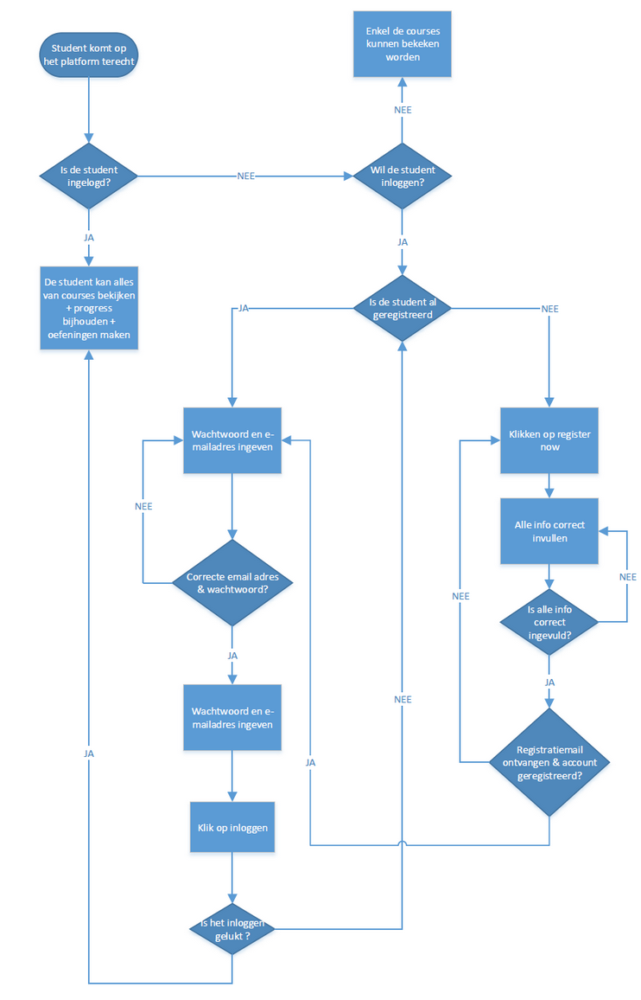
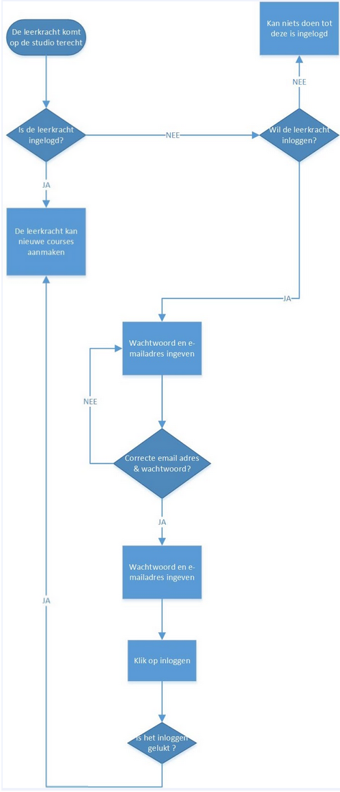
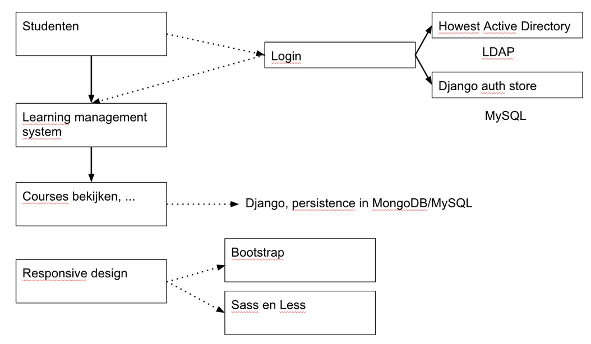

# Informatie-architectuur
## Front-facing

### Uitleg
Het front-facing platform is de plaats waar student op terecht komen. Het is dus het learning management system (LMS) zelf. De studenten loggen hier in met hun Howestlogingevens. Studenten die echter niet studeren aan de Howest hebben ook de mogelijkheid zich te registreren. Ingelogde studenten kunnen hier courses bekijken, oefeningen maken…. De progress van studenten worden automatisch bijgehouden.

## Back-facing

## Uitleg
Het back-facing platform is de plaats waar courses aangemaakt worden. Hier kunnen leerkrachten lessen aanmaken. Het back-facing platform wordt onder edX de ‘Studio’ genoemd. Leerkrachten kunnen hier inloggen met hun standaard howestlogin. 

Nadat leerkrachten ingelogd zijn kunnen ze lessen aanmaken,bewerken, …. 

# Technische analyse
Aangezien we met edX als MOOC platform werken, kunnen we heel wat bestaande dingen behouden. De dingen die we zullen behouden worden hieronder opgesomd: 
*	Eerst en vooral behouden we de taal waarin edX geschreven is, Phyton.
*	Aangezien studenten kunnen inloggen wordt er bij edX zelf al reeds gebruik gemaakt van een login portaal. We opteren dan ook om de reeds bestaande infrastructuur te gebruiken.
*	Bij edX is het reeds mogelijk om oefeningen aan te maken en te wijzigen. Deze wordt uiteraard behouden en gebruikt.
*	Ten laatste zit er in edX ook al een functie die de progress van een gebruiker en meer informatie hieromtrent opslaat. 

Om het platform naar onze hand te zetten en zo functioneler te maken voor het Howest team zullen er ook een aantal dingen moet toegevoegd worden. Deze kunt u terugvinden in onderstaande lijst:
*	Een LDAP server moet toegevoegd worden als extra authentication store.
*	Aangezien het bestaande platform niet responsief is, zullen we er ook voor zorgen dat het ons platform wel responsief is en zo makkelijk te gebruiken is voor de eindgebruiker. Hiervoor bouwen we verder op het ionisx theme. 
*	In plaats van SASS zullen we LESS gebruiken voor de CSS opmaak, we gebruiken  LESS omdat dit standaard wordt gebruikt bij ionisx theme.
*	Het volledige thema voor de front-facing site moet aangepast worden.

## Technologieën

Op bovenstaande afbeelding is de technische analuse voor de front-facing site (het LMS) terug te vinden

### Authenticatie
Authenticatie wordt voorzien zoals in standaard Django app, namelijk Django zelf. Als authentication providers gebruiken we zowel LDAP als een modelbacked provider. De LDAP-provider wordt gebruikt om verbinding te maken naar het schoolnetwerk en daar te authentiseren. Als je geen Howestaccount hebt, kan je toch nog registreren. Wanneer dit gebeurd komt je account in de MySQL store terecht.

### Lessen
Lessen worden opgeslagen in een MongoDB database. Het lijkt misschien raar dat er 2 verschillende databases gebruikt worden, maar volgens het edX-team is een document database een dichtere match om de lessen in op te slaan. We zien geen reden om hun expertise in vraag te stellen.

### Design
Het standaarddesign in edX is niet responsive, wat voor ons niet aanvaardbaar is. De dag van vandaag is een reponsive website van groot belang, er zijn immers heel wat mensen die een site met hun smartphone/tablet bezoeken. Daarom ontwikkelen we een responsive design, gebaseerd op LESS en Bootstrap.

# Functionele analyse
Het MOOC platform is zowel toegankelijk voor studenten als voor leerkrachten al wordt er voor beiden een ander deel van het platform benuttigd. 

Leerkrachten hebben de mogelijkheid zich in te loggen in de edX Studio. Hier is het mogelijk om lessen aan te maken.

Studenten daarentegen krijgen enkel toegang tot het LMS, een ander deel van het platform. Het is van groot belang dat dit deel van het platform er goed uitziet en daarbij ook nog eens responsive is zodat het platform op een groot deel toestellen een goed uitzicht heeft. Deze kant van het platform moet zeker en vast over de Howestbranding beschikken.

De studenten hun progress wordt ook bijgehouden per vak en per hoofdstuk. De studenten kunnen ook hun progress zien en zien hoe goed ze het doen in vergelijking met andere studenten.

#Basis voor start van productie
De voorbije week werden er heel wat dingen klaargemaakt om zo efficiënt mogelijk aan de productie te kunnen starten. Zo werd de vagrant server klaar gemaakt voor gebruik en werkt deze ondertussen. Ten tweede werden wireframes ontwikkeld voor een groot deel van de mogelijk schermen die zowel studenten (edX LMS)  als docenten (edX Studio) kunnen zien. Als laatste werd er al eens gekeken naar de Howest branding en kleuren die nodig zullen zijn bij de front-end. Verder is een basis aangelegd voor de implementatie van een nieuw responsief theme op basis van Bootstrap en Less.

#Sitemap TO DO 

#Design
