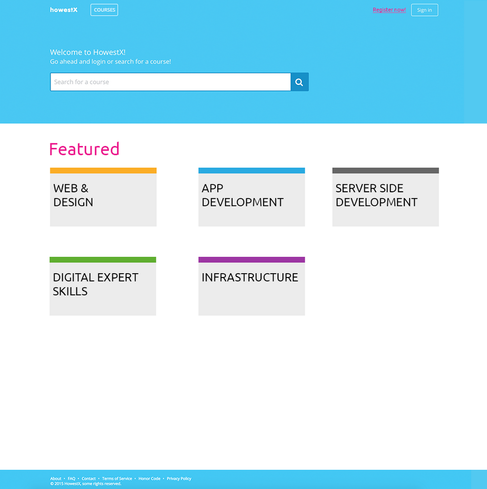
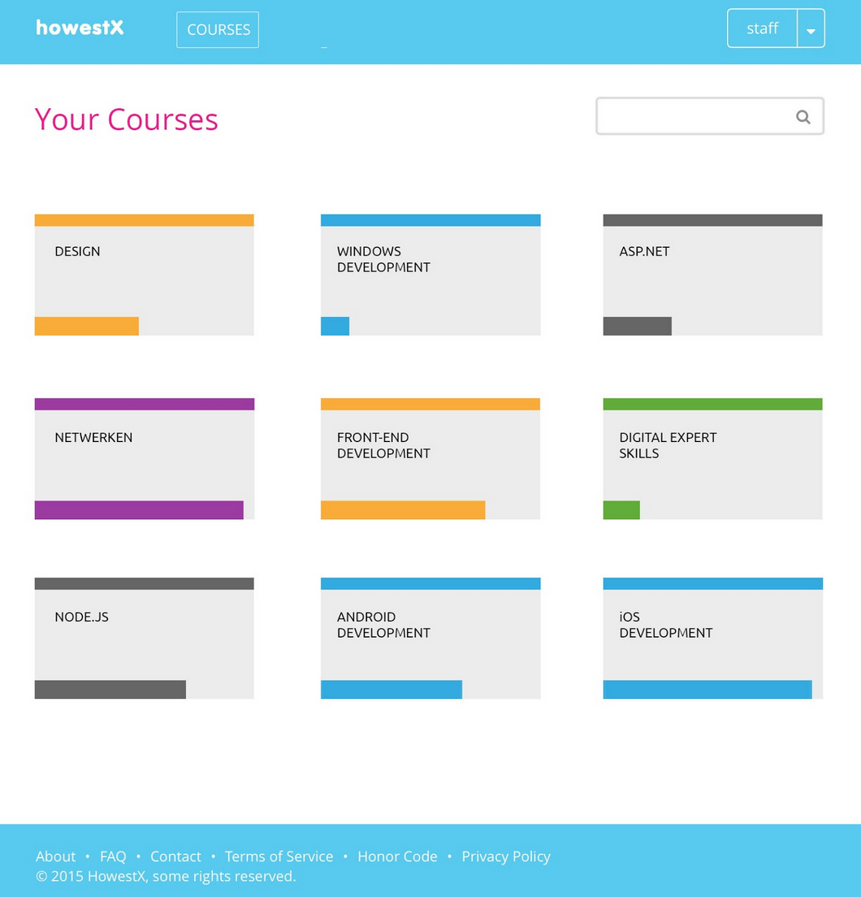
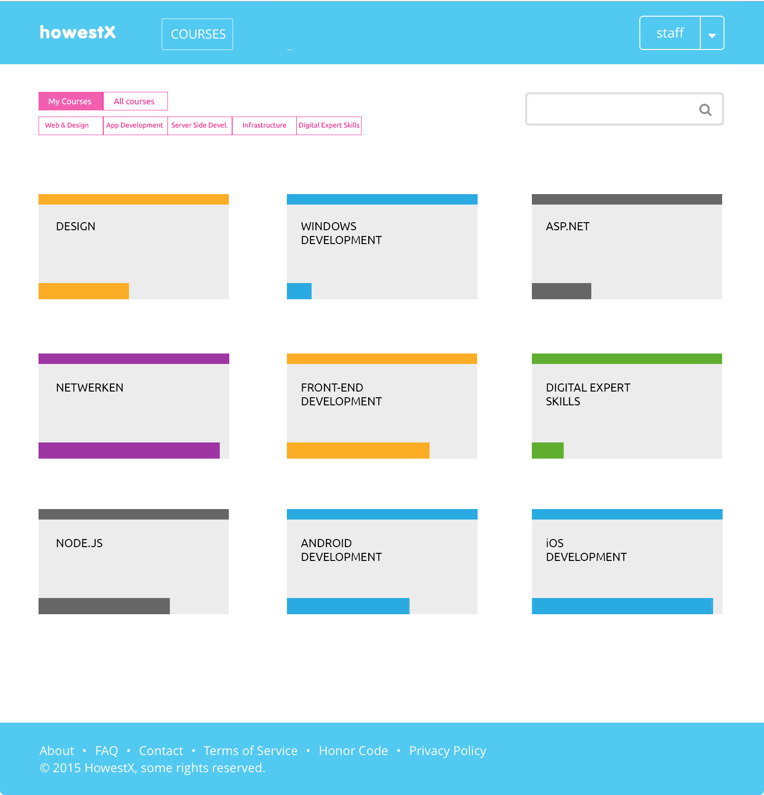
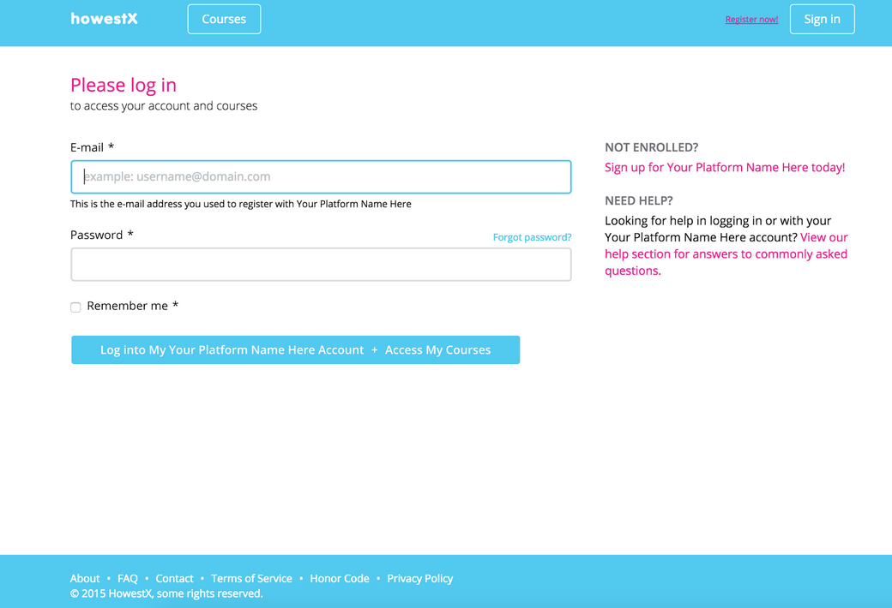
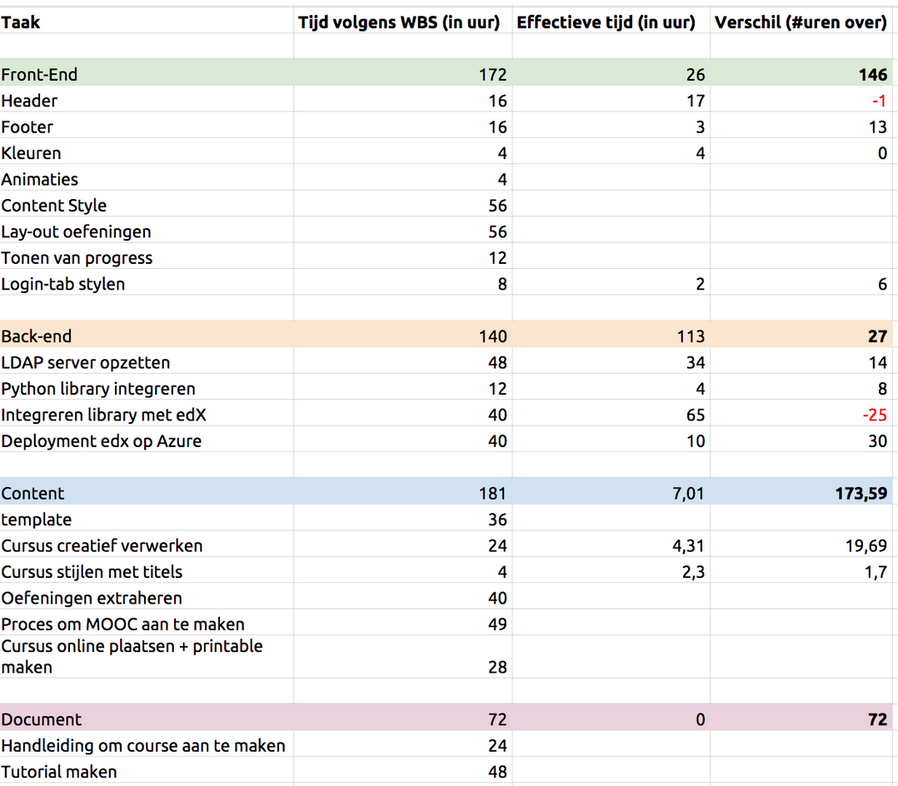
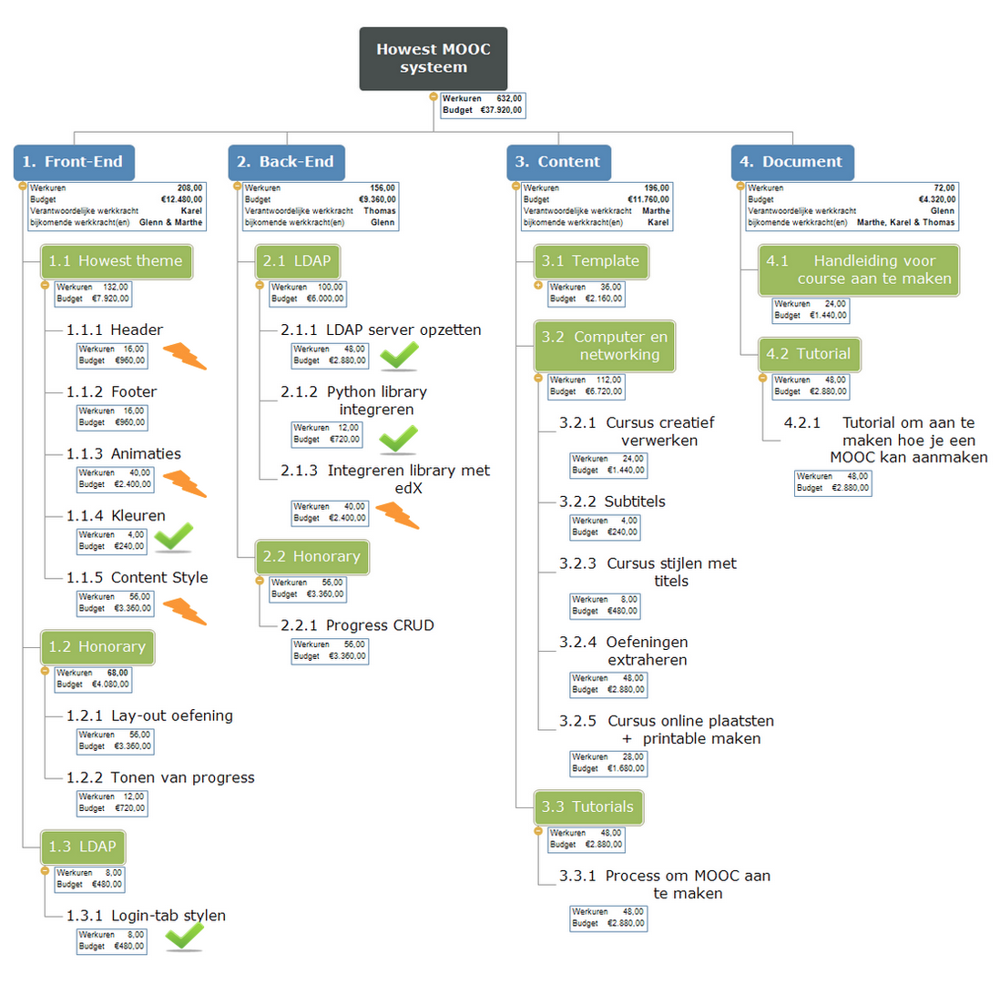
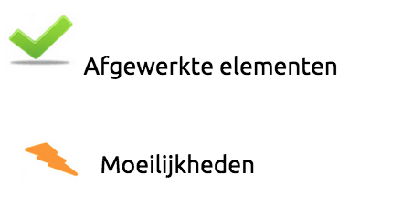
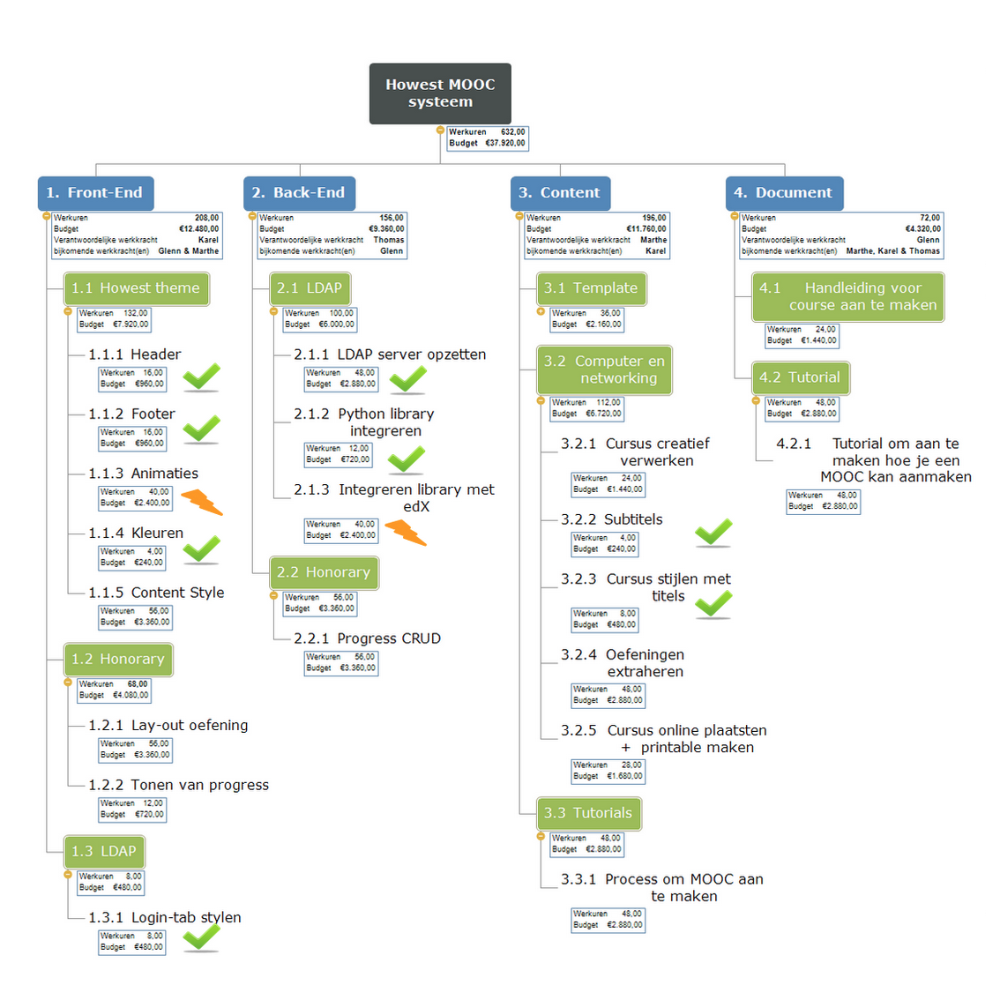

# Informatie-architectuur
## Front-facing

### Uitleg
Het front-facing platform is de plaats waar student op terecht komen. Het is dus het learning management system (LMS) zelf. De studenten loggen hier in met hun Howestlogingevens. Studenten die echter niet studeren aan de Howest hebben ook de mogelijkheid zich te registreren. Ingelogde studenten kunnen hier courses bekijken, oefeningen maken…. De progress van studenten worden automatisch bijgehouden.

## Back-facing

## Uitleg
Het back-facing platform is de plaats waar courses aangemaakt worden. Hier kunnen leerkrachten lessen aanmaken. Het back-facing platform wordt onder edX de ‘Studio’ genoemd. Leerkrachten kunnen hier inloggen met hun standaard howestlogin. 

Nadat leerkrachten ingelogd zijn kunnen ze lessen aanmaken,bewerken, …. 

# Technische analyse
Aangezien we met edX als MOOC platform werken, kunnen we heel wat bestaande dingen behouden. De dingen die we zullen behouden worden hieronder opgesomd: 
*	Eerst en vooral behouden we de taal waarin edX geschreven is, Phyton.
*	Aangezien studenten kunnen inloggen wordt er bij edX zelf al reeds gebruik gemaakt van een login portaal. We opteren dan ook om de reeds bestaande infrastructuur te gebruiken.
*	Bij edX is het reeds mogelijk om oefeningen aan te maken en te wijzigen. Deze wordt uiteraard behouden en gebruikt.
*	Ten laatste zit er in edX ook al een functie die de progress van een gebruiker en meer informatie hieromtrent opslaat. 

Om het platform naar onze hand te zetten en zo functioneler te maken voor het Howest team zullen er ook een aantal dingen moet toegevoegd worden. Deze kunt u terugvinden in onderstaande lijst:
*	Een LDAP server moet toegevoegd worden als extra authentication store.
*	Aangezien het bestaande platform niet responsief is, zullen we er ook voor zorgen dat het ons platform wel responsief is en zo makkelijk te gebruiken is voor de eindgebruiker. Hiervoor bouwen we verder op het ionisx theme. 
*	In plaats van SASS zullen we LESS gebruiken voor de CSS opmaak, we gebruiken  LESS omdat dit standaard wordt gebruikt bij ionisx theme.
*	Het volledige thema voor de front-facing site moet aangepast worden.

## Technologieën

Op bovenstaande afbeelding is de technische analuse voor de front-facing site (het LMS) terug te vinden

### Authenticatie
Authenticatie wordt voorzien zoals in standaard Django app, namelijk Django zelf. Als authentication providers gebruiken we zowel LDAP als een modelbacked provider. De LDAP-provider wordt gebruikt om verbinding te maken naar het schoolnetwerk en daar te authentiseren. Als je geen Howestaccount hebt, kan je toch nog registreren. Wanneer dit gebeurd komt je account in de MySQL store terecht.

### Lessen
Lessen worden opgeslagen in een MongoDB database. Het lijkt misschien raar dat er 2 verschillende databases gebruikt worden, maar volgens het edX-team is een document database een dichtere match om de lessen in op te slaan. We zien geen reden om hun expertise in vraag te stellen.

### Design
Het standaarddesign in edX is niet responsive, wat voor ons niet aanvaardbaar is. De dag van vandaag is een reponsive website van groot belang, er zijn immers heel wat mensen die een site met hun smartphone/tablet bezoeken. Daarom ontwikkelen we een responsive design, gebaseerd op LESS en Bootstrap.

# Functionele analyse
Het MOOC platform is zowel toegankelijk voor studenten als voor leerkrachten al wordt er voor beiden een ander deel van het platform benuttigd. 

Leerkrachten hebben de mogelijkheid zich in te loggen in de edX Studio. Hier is het mogelijk om lessen aan te maken.

Studenten daarentegen krijgen enkel toegang tot het LMS, een ander deel van het platform. Het is van groot belang dat dit deel van het platform er goed uitziet en daarbij ook nog eens responsive is zodat het platform op een groot deel toestellen een goed uitzicht heeft. Deze kant van het platform moet zeker en vast over de Howestbranding beschikken.

De studenten hun progress wordt ook bijgehouden per vak en per hoofdstuk. De studenten kunnen ook hun progress zien en zien hoe goed ze het doen in vergelijking met andere studenten.

#Basis voor start van productie
De voorbije week werden er heel wat dingen klaargemaakt om zo efficiënt mogelijk aan de productie te kunnen starten. Zo werd de vagrant server klaar gemaakt voor gebruik en werkt deze ondertussen. Ten tweede werden wireframes ontwikkeld voor een groot deel van de mogelijk schermen die zowel studenten (edX LMS)  als docenten (edX Studio) kunnen zien. Als laatste werd er al eens gekeken naar de Howest branding en kleuren die nodig zullen zijn bij de front-end. Verder is een basis aangelegd voor de implementatie van een nieuw responsief theme op basis van Bootstrap en Less.

#Sitemap TO DO 

#Design
Om de effectieve plaats en kleuren van elementen te bepalen is het een noodzaak om te kunnen vertrekken vanaf een design. Het design die wij gebruiken is te zien in onderstaande afbeeldingen. Alle kleuren die gebruikt zijn, zijn deze van het kleurpalet van de Howest. 

Op de eerste afbeelding is de homepage te zien. Hierop is bovenaan de header terug te vinden, deze bevat het logo, een registerlink en een knoppen ( 1 om in te loggen en 1 om te navigeren naar de cursussen). Onder de header is er dan een zoekbalk terug te vinden zodat de gebruiker makkelijk een cursus kan opzoeken. Onderaan is er dan een footer terug te vinden met enkele links en de naam van instelling. 

Tussen de header & de footer is er een ‘witgedeelte’ terug te vinden. Dit gedeelte bevat de featured vakken. Deze vakken zijn momenteel deze van nmct, maar kunnen uiteraard aangepast worden. De kleuren die bij deze vakken gebruikt worden, zijn de kleuren van de vakken zelf, zodat dit voor de gebruiker visueel zeer duidelijk is. Wanneer er over de vakken wordt gehoverd, wordt er een kleine border zichtbaar in het kleur van het vak.

Volgende onderstaande afbeelding is deze van het dashboard waar de gebruiker op terecht komt na het inloggen. De kleuren boven de naam van het vak toont onder welk traject het vak valt. Onder de ‘vaknaam’ wordt de progress van de les getoond. De grijze achtergrond kan eventueel vervangen worden door een foto die duidelijker toont over welk vak het gaat.

Vakken worden gesorteerd op meest recente gebruik. Het vak dat het meest recentst bekeken is staat linksboven. De registerknop verdwijnt ook aangezien dat niet meer nodig is als de gebruiker is ingelogd. De loginknop wordt hier vervangen door de username met een openklapmenuutje. 

Op onderstaande afbeelding worden de courses voorgesteld. Dit scherm lijkt qua lay-out heel sterk op deze van het dashboard met dat verschil dat er bovenaan nog een extra navigatie aanwezig is. Zo navigeert de gebruiker tussen cursussen. Daarnaast is navigatie ook mogelijk aan de hand van de vakken waartoe cursussen behoren.

# Ontwikkeling front-end
In een vroeger stadium werd het kleurpalet van de Howest reeds onderzocht. Deze kleuren zijn ondertussen geïmplementeerd in het theme. Zo kreeg de header en de footer de juiste kleur , namelijk de blauwe kleur van de howest en werden titels roze gekleurd. 

Ondertussen is al heel wat gewerkt aan de front-end zijde. De header & de footer werden al onderhanden genomen. Er kan intussen besloten worden dat deze klaar zijn. In de header staat linksboven het howestX logo dit is gebaseerd op het alom bekende witte Howest logo.  Verder bevat de header nog een knop ‘Courses’ deze navigeert uiteraard naar een overzicht van de courses. Helemaal rechts is er ook nog een ‘Sign in’ knop terug te vinden die de gebruiker doorverwijst naar de loginpagina. 

De loginpagina is ondertussen ook afgewerkt. Zowel de header en footer als de logintab zijn te zien op onderstaande afbeelding. Hier is te zien dat zowel de titel als de link een howestroze kleur heeft. De knop is dan weer het intussen bekende howestblauw.

Verder werd er ook hard gewerkt aan de homepage. Deze is intussen volledig in orde gebracht. De homepage bevat zoals te zien is op onderstaande afbeelding een header en footer. Net onder de header is een zoekvenster terug te vinden waar het mogelijk is om een een course te zoeken. Onder dit zoekvenster zijn er 5 elementen terug te vinden. Deze zijn nu specifiek ontworpen op basis van de NMCT kleuren en vakken maar dit kan natuurlijk aangepast worden aan bijvoorbeeld deze van Devine of een andere howestrichting. De lessen die er nu opstaan zijn momenteel nog demo courses, deze wordt dan later nog aangepast 

[Image courses ](images/CoursesOntwerp.png "Image courses")

# Ontwikkeling back-end
## LDAP
LDAP werkt momenteel, al zijn er wel enkele dingen op aan te merken.
Inloggen moet momenteel gebeuren met enkel je voornaam.achternaam, bijvoorbeeld ‘glenn.van.weyenberg’. Dus zonder het ‘@student.howest.be’ gedeelte. Dit door de zware restricties van Django usernames.

Het implementeren van LDAP was een zeer complexe opgave. Het deployen ervan zal normaal nog meevallen doordat we enkel wat aanpassingen zullen moeten voorzien in de Ansible files, maar dit is nog te zien.

## edX named releases
Omdat edX een platform is dat heel snel evolueert, voorziet men nu “named releases”. Dit zijn LTS-versies, een beetje zoals Ubuntu ook werkt. Tussen twee named releases zal een upgrade path voorzien worden. Het is logisch dat we verder werken op de laatste named release, aangezien die stabiel is.  Dit heeft als voordeel dat er makkelijk een support voor gevonden worden, de onderhoudbaarheid vergroot (niet elke dag gaan upgraden) en edX een upgrade path kan voorzien worden tussen twee named releases.
De eerste named release was Aspen. Momenteel zitten we aan de tweede named release, Birch. Deze is gereleased op 24 februari 2015, tamelijk recent dus. De volgende named release zal Cypress heten.
Wij zullen dus werken op de named release Birch. Graag hadden we geweten wat de plannen zijn voor Cypress, maar daar hebben we geen informatie over teruggevonden.
Een voorbeeld van een upgrade van Aspen naar Birch:

    ./migrate.sh -c devstack

Deze simpele regel code runt een script die alles automatisch migreert. We zijn hier erg tevreden over en het versterkt ons vertrouwen in edX als platform.

## Certificate
Sommige mensen willen gewoon een course doorlopen om zelf iets bij te leren, maar anderen willen de course doorlopen en een bewijs hebben dat ze voor die course geslaagd zijn. En nog andere mensen willen een echt certificaat dat bewijst dat een onderwijsinstelling geverifieerd heeft dat ze geslaagd zijn, dit om bijvoorbeeld in aanmerking te komen voor bepaalde jobs. Kortom, er is certificatie nodig.

## Certificatie in edX
EdX voorziet al verificatie in de vorm van certificaten. Er zijn enkele soorten certificaten.

### Honor code certificates
Dit is een standaard certificaat die zegt dat je een bepaalde course doorlopen hebt. Er is wel geen verificatie van je identiteit.

### Verified certificates
Dit certificaat bewijst dat je geslaagd bent voor een course en verifieert ook je identiteit. Dit gebeurd door middel van je identiteitskaart en enkele foto's die genomen kunnen worden met je webcam. Gebruikers moeten aangeven dat zij geïnteresseerd zijn in dit certificaat bij het deelnemen aan een course. Aan dit certificaat hang welt een kleine vergoeding aan vast, deze is echt variabel per course. 

### XSeries certificates
Deze certificaten kunnen verkregen worden wanneer je slaagt voor een reeks courses over eenzelfde onderwerp. Denk hierbij misschien aan de verschillende tracks binnen NMCT. Zo zou je bijvoorbeeld een XSeries certificate kunnen hebben voor web developer.

## Wat met gearchiveerd courses?
Wanneer een course gearchiveerd is, zijn er geen certificaten meer beschikbaar. De course kan wel nog volledig gevolgd worden zonder zaken zoals forums.

## Zijn terugbetalingen mogelijk?
Ja dit is mogelijk maar dit enkel binnen een bepaalde periode. Deze periode is 2 weken berekend vanaf de startdatum van de course. Deze persoon kan aangeven dat hij de course niet verder volgt (voor een betalend certificaat). Na 2 weken is terugbetaling niet meer mogelijk.

## Wat wanneer een certificaat is behaald?
Wanneer er een certificaat behaald is, zal je het certificaat ontvangen met een 'edx verified' stempel. Ook zal je een link krijgen die je eenvoudig kan delen met mensen of bijvoorbeeld op je LinkedIn plaatsen.

## Opzetten van een fullstack
Tot nu toe hebben we altijd op de zogenaamde devstack gewerkt. Deze is echter niet geschikt om een werkende demo te kunnen geven conform aan de productie. Met de devstack is het immers niet mogelijk om de LMS en de CMS tegelijkertijd te runnen, waardoor het geven van een demo onmogelijk wordt. Met de fullstack daarentegen kan je de LMS en de CMS tegelijk runnen, hierdoor kan wel een volledige demo gegeven worden. Helaas is het hier op Howest niet mogelijk te verbinden met een externe LDAP-server waardoor een demo geven op de fullstack niet mogelijk is.

## Wat heb je nodig voor een werkende one-server fullstack?
Een kleine voorbeeldsetup om tot honderden studenten aan te kunnen op een enkele server.

Nodig:

* Ubuntu 12.04 amd64 (met oraclejdk)
* Min 2GB geheugen, 4GB aangeraden
* Min 2.00GHz CPU
* Min 25GB Disk space, 50GB aangeraden

## Azure Active Directory
Werken met Azure Active Directory zou een perfecte match zijn voor Howest.
Dit omdat Howest al zo een Directory heeft die gesyncd wordt met de on-premises AD.
Wat wel raar is, is dat AAD geen LDAP gebruikt, het maakt gebruik van OAuth. Daar is wel al een Django plugin voor voorzien, maar nog niet in edX. Daar wordt wel aan gewerkt, maar dit is nog vrij recent en de discussie daarrond is nog volop bezig.

# Huidige tijdregistratie - week 3
Niet alles die in deze lijst staat is reeds afgewerkt. Er zijn wel al wat dingen waar we aan begonnen zijn en waar reeds wat tijd aanbesteed is. In de WBS achteraan kan er geraadpleegd worden wat er allemaal al klaar is. Hieronder kunt u wel een lijst raadplegen over de hoeveelheid tijd die al besteed is geweest. Ook het tussentijdse verschil kunt u zien.

Een belangrijk punt om op te merken is het feit dat er bij deployment van edX op Azure momenteel 10 uur staat, maar dit is nog NIET afgewerkt. Er kan algemeen besloten worden dat er qua tijd redelijk kleine verschillen zijn en dat sommige dingen sneller verlopen dan gepland.

# WBS: Week 2

# WBS: Week 3

# WBS: Week 4
Zoals u op onderstaande figuur kunt zien, werd heel wat afgewerkt in week 4. Enkele dingen moeten wel in acht genomen worden.
Zo is de cursus online geplaatst maar zijn er geen extra elementen aangepast om de cursus printable te maken. We hebben hier geen extra tijd meer ingestoken omdat er achteraf gezien niet zo'n grote vraag aanwezig is voor het afdrukken van de cursus. Dit komt omdat er heel wat filmpjes aanwezig zullen zijn.

De progress van leerlingen kan ook bijgehouden worden maar er kan bij ons systeem nog niet gewerkt worden met certificaten. In de documentatie is wel volledig terug te vinden hoe dit opgezet moet worden.

# Finale design
Aan het design dat in de vorige weken werd gemaakt werden tijdens week 3 en 4 toch nog heel wat dingen aangepast. We zijn met ons definitief ontwerp ook eventjes naar een professionele designer namelijk Angelo Fallein. Op onderstaande afbeeldingen is te zien hoe het design er nu werkelijk uitziet

# Problemen
We zijn tijdens het werken heel wat problemen tegengekomen. In dit hoofdstuk worden de belangrijkste problemen aangehaald.

## Algemeen
* Vagrant blijft vaak lastig doen. Het is dan ook soms nodig een ‘vagrant destroy’ uit te voeren. Dit neemt heel wat kostbare tijd in beslag daar de hele vagrant VM opnieuw geïnstalleerd en klaargezet moet worden.

* Windows zorgde ook voor vele problemen, dit door het feit dat onze vagrant VM en Windows niet samengaan. De VM maakt gebruik van symlinks die niet worden herkend door windows. Dit zorgde ervoor dat we hebben moeten overschakelen naar linux, wat alweer tijd in beslag nam.

* Wanneer er op het platform huiswerk of een examen aangemaakt wil worden, kan dit niet door middel van bijvoorbeeld een vinkje aan te zetten. Er moet echter altijd ‘Homework:’ of “Final exam: ” in de titel meegeven worden.

## Front-end
* Doordat sommige CSS klassen 3 keer overschreven worden is het soms moeilijk om te weten waar je de styling precies moet aanpassen. Het is een struikelblok, maar eenmaal je de structuur van het theme door hebt, loopt het aanpassen al wat vlotter.

* Als we een html-file toevoegen of aanpassen moeten we lang wachten tot deze te zien is in de browser.

## Back-end
* Het implementeren van LDAP is een zeer complexe en problematische opgave. Door de complexiteit van edX was het dan ook zeer lastig om de correcte files te vinden. Het feit dat edX veel settingfiles inlaadt en overschrijft helpt niet. Eens we de correcte files gevonden hadden en LDAP erin verwerkt hadden bleek het ook nog eens lastig te zijn om de user properties correct te binden in Django. Uiteindelijk is LDAP werkend geraakt mits een kleine beperking omtrent de username die gebruikt moet worden.

* Het opzetten van een fullstack installatie in de cloud is ook en probleempunt. Dit doordat de installatie telkens crasht bij het onderdeel ‘xqwatcher’.

* Een andere probleem die we tegenkwamen was het feit de certificaten niet werken. 
